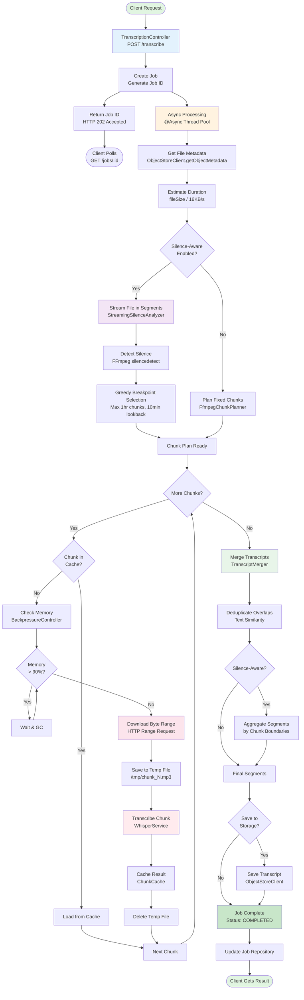
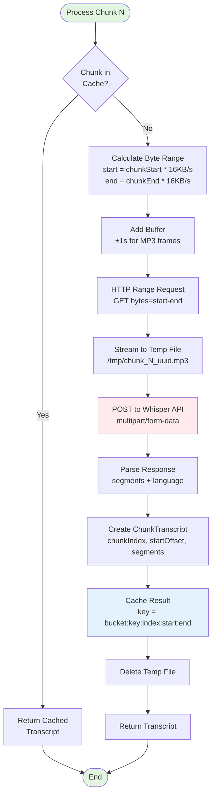
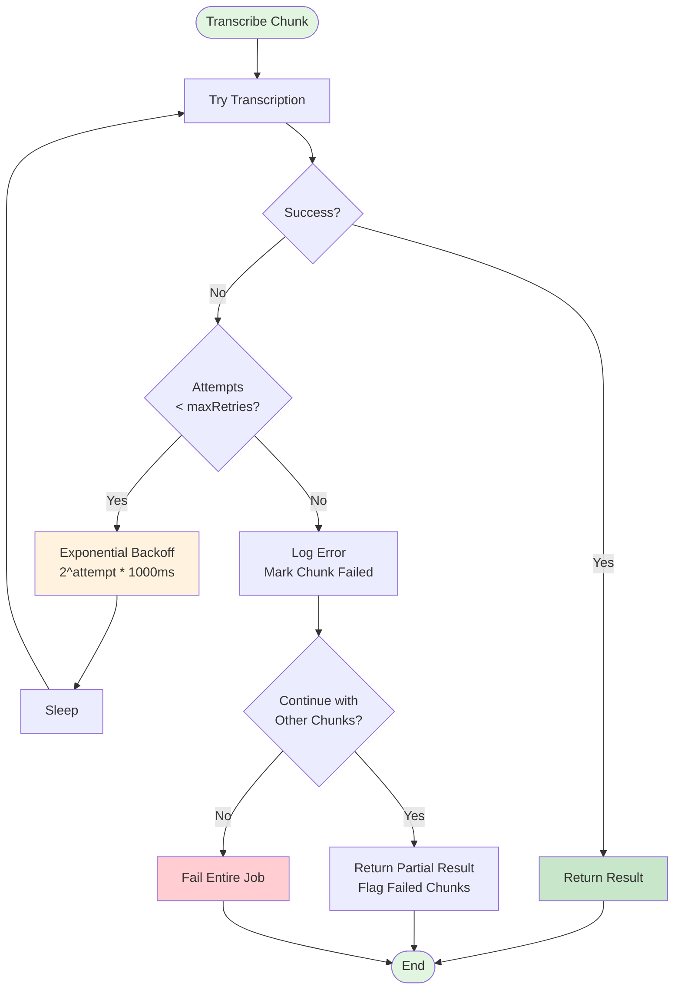
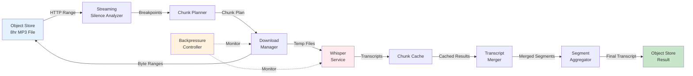

# MP3 Handler System Flowchart

## High-Level Architecture Flow



## Detailed Streaming Silence Analysis Flow

```mermaid
graph TB
    Start([Start Greedy Analysis]) --> Init[Initialize<br/>currentPosition = 0<br/>breakpoints = []]
    
    Init --> Loop{currentPosition<br/>< totalDuration?}
    
    Loop -->|Yes| CalcSegment[Calculate Segment<br/>analyzeUntil = min(pos + 1hr, end)]
    CalcSegment --> CalcBytes[Calculate Byte Range<br/>startByte = pos * 16KB/s<br/>endByte = analyzeUntil * 16KB/s]
    
    CalcBytes --> DownloadSeg[Download Segment<br/>HTTP Range Request]
    DownloadSeg --> FFmpeg[Run FFmpeg silencedetect<br/>on Segment]
    
    FFmpeg --> AdjustTime[Adjust Timestamps<br/>to Absolute Position]
    AdjustTime --> FilterSilence[Filter Silences<br/>duration >= 1.0s]
    
    FilterSilence --> CalcLookback[Calculate Lookback Window<br/>start = analyzeUntil - 10min<br/>end = analyzeUntil]
    
    CalcLookback --> FindBest{Find Longest<br/>Silence in Window?}
    
    FindBest -->|Found| UseSilence[Use Silence Midpoint<br/>as Breakpoint]
    FindBest -->|Not Found| UseMax[Use Max Duration<br/>as Breakpoint]
    
    UseSilence --> AddBreak[Add to breakpoints]
    UseMax --> AddBreak
    
    AddBreak --> UpdatePos[currentPosition = breakpoint]
    UpdatePos --> DeleteTemp[Delete Temp Segment]
    DeleteTemp --> Loop
    
    Loop -->|No| Return([Return Breakpoints])
    
    style Start fill:#e1f5e1
    style Return fill:#e1f5e1
    style FFmpeg fill:#ffebee
    style FindBest fill:#fff3e0
```

## Chunk Processing Detail



## Transcript Merging Flow

```mermaid
graph TB
    Start([Merge Chunks]) --> Init[Initialize<br/>merged = []<br/>lastEndTime = 0]
    
    Init --> Loop{More Chunks?}
    
    Loop -->|Yes| GetChunk[Get Next Chunk]
    GetChunk --> SegLoop{More Segments<br/>in Chunk?}
    
    SegLoop -->|Yes| GetSeg[Get Next Segment]
    GetSeg --> AdjustTime[Adjust Timestamps<br/>absoluteStart = chunkOffset + segStart<br/>absoluteEnd = chunkOffset + segEnd]
    
    AdjustTime --> CheckOverlap{absoluteStart<br/>< lastEndTime?}
    
    CheckOverlap -->|Yes| CheckDup{Is Duplicate?<br/>Similar timing<br/>+ text?}
    CheckOverlap -->|No| AddSeg[Add to Merged]
    
    CheckDup -->|Yes| Skip[Skip Segment<br/>Log Duplicate]
    CheckDup -->|No| AddSeg
    
    AddSeg --> UpdateLast[lastEndTime = max(last, absEnd)]
    Skip --> SegLoop
    UpdateLast --> SegLoop
    
    SegLoop -->|No| Loop
    Loop -->|No| Return([Return Merged Segments])
    
    style Start fill:#e1f5e1
    style Return fill:#e1f5e1
    style CheckDup fill:#fff3e0
    style Skip fill:#ffcdd2
```

## Memory Management & Backpressure

```mermaid
graph TB
    Start([Before Processing Chunk]) --> GetMem[Get Memory Usage<br/>used / max heap]
    
    GetMem --> Check90{Usage<br/>> 90%?}
    
    Check90 -->|Yes| Pause[Pause Processing<br/>Log Warning]
    Pause --> Wait[Sleep 1 second]
    Wait --> GetMem
    
    Check90 -->|No| Check85{Usage<br/>> 85%?}
    
    Check85 -->|Yes| SuggestGC[Suggest GC<br/>System.gc()]
    Check85 -->|No| Check75{Usage<br/>> 75%?}
    
    Check75 -->|Yes| LogWarn[Log Warning]
    Check75 -->|No| LogInfo[Log Info]
    
    SuggestGC --> Proceed
    LogWarn --> Proceed
    LogInfo --> Proceed
    
    Proceed([Proceed with Chunk])
    
    style Start fill:#e1f5e1
    style Proceed fill:#c8e6c9
    style Pause fill:#ffcdd2
    style SuggestGC fill:#fff3e0
```

## Error Handling & Retry



## Data Flow Summary



